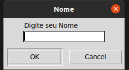
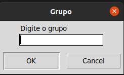
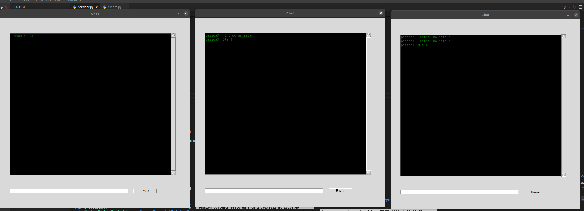
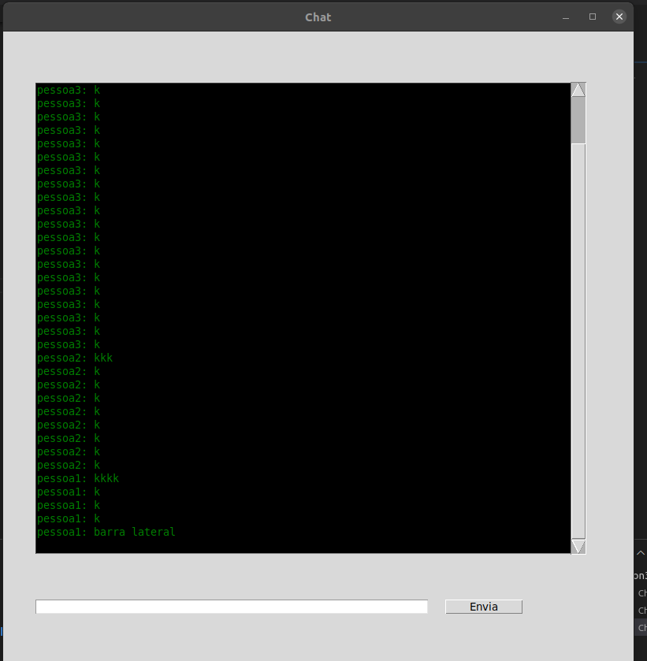

# chat.realTime.python
Projeto de um Chat separado por Salas

Para utilizar e necessario rodar o script Servidor para abrir a porta e criar o canal

Apos execultar o script do Servidor rodando o Cliente aparecerar esta janela pedindo o Nome so usuario

Apos o usuario Sera solicitado o Grupo

Apos digitar um nome de Grupo ja existente sera direcionado aos menbros deste Grupo

No exemplo utilizei o grupo "Jogos" mas podria ser qualquer um 

Fiz a implementacao de uma Scrollbar lateral para rolar as mensagens e quando envia Mensagem a mesma e apagada

